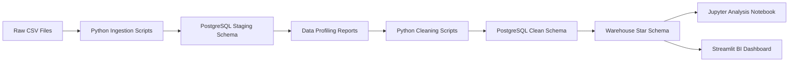

# Egyptian Retail & Financial Analytics Platform

An end-to-end data engineering and business intelligence project built on a simulated retail dataset. The project covers the full analytics pipeline lifecycle: raw CSV ingestion, PostgreSQL staging, automated profiling, data cleaning, warehouse star schema design, exploratory analysis, statistical testing, revenue forecasting, and an interactive Streamlit BI dashboard.

This project was developed to demonstrate practical data engineering, analytics, and business intelligence skills aligned with consulting and enterprise data environments.

---

## Project Overview

The goal of this project is to simulate the analytics infrastructure of a retail company that wants to understand revenue performance, customer behavior, product category performance, delivery reliability, and payment preferences.

The original source data is loaded into PostgreSQL, cleaned programmatically using Python, transformed into a warehouse star schema, analyzed in Jupyter notebooks, and visualized through an interactive Streamlit dashboard.

---

## Tech Stack

| Tool                 | Purpose                                                     |
| -------------------- | ----------------------------------------------------------- |
| Python 3.11          | ETL, cleaning, analysis, forecasting, dashboard development |
| PostgreSQL           | Database and analytical warehouse                           |
| pandas               | Data manipulation and transformation                        |
| SQLAlchemy           | Python-to-PostgreSQL connection                             |
| ydata-profiling      | Automated data profiling                                    |
| Jupyter Notebook     | Exploratory analysis and statistical modelling              |
| Prophet              | Revenue forecasting                                         |
| scikit-learn / scipy | Model evaluation and statistical testing                    |
| Streamlit            | Interactive BI dashboard                                    |
| Plotly / Matplotlib  | Data visualization                                          |
| Git / GitHub         | Version control and project portfolio                       |

---

## Project Architecture



---

## Database Layers

### 1. Staging Schema

The `staging` schema stores the raw loaded CSV tables with minimal transformation. This keeps the original data available for inspection and profiling.

### 2. Clean Schema

The `clean` schema stores programmatically cleaned tables. Cleaning steps include:

* Datetime conversion
* Missing-value handling
* Duplicate checks
* Invalid value filtering
* Business flag creation
* Feature engineering

### 3. Warehouse Schema

The `warehouse` schema stores the analytical star schema.

Dimension tables:

* `warehouse.dim_date`
* `warehouse.dim_customer`
* `warehouse.dim_product`
* `warehouse.dim_seller`

Fact table:

* `warehouse.fact_order_items`

---

## Key Features

* Full Python ETL pipeline from raw CSV files to PostgreSQL
* Automated data profiling and documented quality observations
* Data quality log documenting every cleaning decision
* Warehouse star schema with surrogate keys
* Query performance testing using `EXPLAIN ANALYZE`
* Index creation for analytical query optimization
* Jupyter notebook with exploratory analysis
* RFM customer segmentation
* A/B test simulation with statistical testing
* Prophet-based revenue forecasting
* Interactive Streamlit BI dashboard

---

## Analysis Completed

### Revenue Trends

Monthly revenue analysis was performed using the warehouse fact table and date dimension. The trend shows revenue growth over time and supports business monitoring of sales performance.

### Customer Segmentation

RFM segmentation was used to group customers into:

* Champions
* Loyal Customers
* Potential Customers
* At Risk Customers
* Lost Customers

This supports targeted marketing and retention strategy.

### Product Category Performance

Product categories were ranked by revenue, order count, item count, and average item value. This helps identify the most commercially important categories.

### Delivery Performance

Delivery analysis measured average delivery duration, on-time delivery rate, undelivered items, and slowest product categories by delivery time.

### Payment Insights

Payment behavior was analyzed using the cleaned payments table, including payment value by method and installment payment behavior.

### Forecasting

A Prophet model was used to forecast daily revenue. The model provided a directional forecast and was evaluated using MAE and MAPE.

---

## Streamlit Dashboard

The project includes an interactive Streamlit dashboard with the following sections:

1. Executive Overview
2. Revenue Trends
3. Product Category Performance
4. Geography Analysis
5. Delivery Performance
6. Payment Insights
7. Forecasting Summary

The dashboard connects directly to PostgreSQL and allows users to filter by date range, year, product category, customer state, and seller state.

---

## How to Run This Project

### 1. Clone the repository

```bash
git clone https://github.com/clarazaher/Egyptian-Retail-Financial-Analytics-Platform.git
cd Egyptian-Retail-Financial-Analytics-Platform
```

### 2. Create and activate the virtual environment

```bash
python -m venv venv
source venv/bin/activate
```

### 3. Install dependencies

```bash
pip install -r requirements.txt
```

### 4. Set the PostgreSQL password

```bash
export DB_PASSWORD='your_postgres_password_here'
```

### 5. Run ingestion

```bash
venv/bin/python scripts/01_ingestion/load_raw_data.py
```

### 6. Run profiling

```bash
venv/bin/python scripts/01_ingestion/profile_data.py
```

### 7. Run cleaning scripts

```bash
venv/bin/python scripts/02_cleaning/clean_orders.py
venv/bin/python scripts/02_cleaning/clean_customers.py
venv/bin/python scripts/02_cleaning/clean_order_items.py
venv/bin/python scripts/02_cleaning/clean_products.py
venv/bin/python scripts/02_cleaning/clean_sellers.py
venv/bin/python scripts/02_cleaning/clean_reviews.py
venv/bin/python scripts/02_cleaning/clean_payments.py
```

### 8. Build and load the warehouse

Run the SQL schema file in SQLTools:

```text
scripts/03_warehouse/01_create_schema.sql
```

Then run:

```bash
venv/bin/python scripts/03_warehouse/02_populate_dim_date.py
venv/bin/python scripts/03_warehouse/03_load_warehouse.py
```

Run the indexes SQL file in SQLTools:

```text
scripts/03_warehouse/04_create_indexes.sql
```

### 9. Run the Streamlit dashboard

```bash
venv/bin/python -m streamlit run scripts/04_analysis/dashboard_app.py
```

---

## Project Structure

```text
data/
  raw/
  processed/

docs/
  data_quality_observations.md
  data_quality_log.md
  warehouse_design.md
  dashboard_design.md

notebooks/
  01_exploratory_analysis.ipynb

reports/
  charts/

scripts/
  01_ingestion/
  02_cleaning/
  03_warehouse/
  04_analysis/

README.md
requirements.txt
.gitignore
```

---

## Skills Demonstrated

* Data ingestion
* ETL pipeline development
* PostgreSQL database design
* Data profiling
* Data cleaning and validation
* Dimensional modelling
* Star schema warehouse design
* SQL query optimization
* Exploratory data analysis
* Customer segmentation
* Statistical hypothesis testing
* Time-series forecasting
* Dashboard development
* Git/GitHub project management

---

## Notes

This project uses a public e-commerce dataset to simulate a fictional retail analytics environment. The business context is adapted for portfolio and learning purposes.
